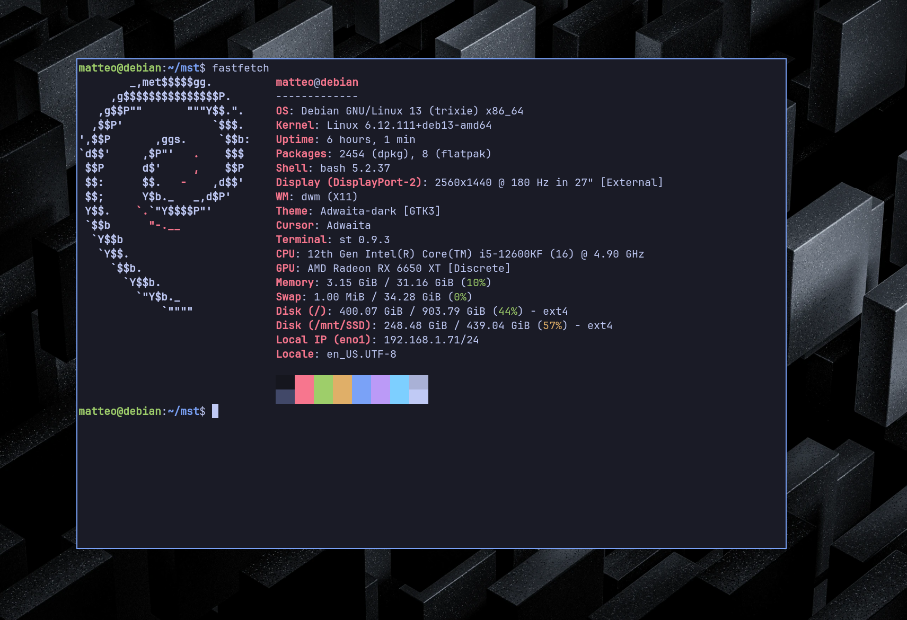

# St configuration



## Requirements
- make
- gcc
- Jet Brains Nerd font (see the script)
- wget 
- curl
- unzip 

## installaation:
```
cd ~/mst
./scripts/jetbrains.sh
sudo make clean install
```


